# OrderFlow — Supply Chain Order Processing Pipeline

## Overview
OrderFlow is an enterprise supply chain order processing pipeline built on Workato. It automates the complete order ingestion lifecycle — from CSV file detection in AWS S3 to row-level validation, duplicate detection, data transformation, MySQL persistence, real-time notifications, and file archival — with partial success processing, dead letter queue logging, and execution observability.

## Business Problem
Supplier orders commonly arrive as CSV files via file transfer systems (S3, SFTP, FTP). Manual processing causes:
- Delayed order entry and fulfillment
- Duplicate orders creating inventory conflicts
- Inconsistent data formats across suppliers
- No visibility into processing failures
- No audit trail for compliance

OrderFlow automates the complete order ingestion pipeline — validating, transforming, persisting, and notifying in seconds rather than hours.

## Live Demo
| File | Description |
|---|---|
| [orders_batch_001.csv](sample-files/orders_batch_001.csv) | Sample file with intentional errors (validation failures + duplicate) |
| [orders_batch_clean_001.csv](sample-files/orders_batch_clean_001.csv) | Clean file with all valid orders |

## Architecture

## Workflow

1. Supplier drops CSV file into AWS S3 `incoming/` folder
2. Workato detects new file via event-driven S3 trigger
3. Pipeline initializes execution counters (total, processed, failed, duplicates)
4. For each row in CSV:
   - **Validation** — checks Order ID format, email format, quantity > 0, unit price > 0
   - If validation fails → row logged to `failed_orders` table (Dead Letter Queue)
   - If validation passes → **Duplicate check** via MySQL SELECT on order_id
   - If duplicate found → row logged to `failed_orders` table
   - If new order → **Data transformation** (normalize name, uppercase product code, calculate total)
   - Insert to `orders` table
   - Insert to `order_events` table (ORDER_RECEIVED event)
   - Increment processed counter
5. Update total_rows counter
6. Insert execution summary to `execution_metrics` table
7. Call Recipe 02 — Notification Handler (Gmail + Slack)
8. Archive file:
   - Failures detected → move to `failed/filename_partial.csv`
   - No failures → move to `processed/filename_processed.csv`
9. Delete original file from `incoming/` folder

## Recipes
| Recipe | Description |
|---|---|
| 01 - Order Processing Pipeline | Main orchestration — S3 trigger, row-level processing, MySQL persistence, file archival |
| 02 - Notification Handler | Centralized callable recipe for Gmail and Slack notifications |

## Tech Stack
| Tool | Purpose |
|---|---|
| Workato | iPaaS orchestration platform |
| AWS S3 | Event-driven file trigger + file lifecycle management |
| MySQL (Aiven Cloud) | Order persistence, audit trail, dead letter queue, execution metrics — cloud-hosted managed MySQL, production-equivalent setup |
| Gmail | Processing summary + failure alerts |
| Slack | Real-time pipeline alerts to #orderflow-alerts |
| DBeaver | MySQL database management and schema validation |
| Postman | API and webhook testing |

## AWS S3 Structure
| Folder | Purpose |
|---|---|
| `incoming/` | Workato monitors this folder — new CSV files trigger the pipeline automatically |
| `processed/` | Successfully processed files archived here with `_processed` suffix |
| `failed/` | Partially failed files archived here with `_partial` suffix |

**Bucket name:** `orderflow-pipeline`
**Region:** ap-southeast-2 (Sydney)
**IAM Policy:** `OrderFlow-S3-LeastPrivilege` — least privilege access for Workato

## Database Schema

### orders
Stores all successfully validated and processed orders.

| Column | Type | Description |
|---|---|---|
| id | INT (PK, AI) | Auto-increment primary key |
| order_id | VARCHAR(50) UNIQUE | Business key — ORD-XXXX format enforced via validation |
| customer_name | VARCHAR(100) | Normalized — trimmed and capitalized during transformation |
| customer_email | VARCHAR(100) | Validated via regex before insert |
| product_code | VARCHAR(50) | Uppercased during transformation |
| quantity | INT | Validated > 0 before insert |
| unit_price | DECIMAL(10,2) | Validated > 0 before insert |
| total_value | DECIMAL(10,2) | Computed field: quantity × unit_price |
| status | VARCHAR(20) | RECEIVED / PROCESSING / COMPLETED |
| source_file | VARCHAR(200) | Source CSV filename for traceability |
| created_at | TIMESTAMP | Auto-set on insert |

### order_events
Order lifecycle audit trail — one row per event per order.

| Column | Type | Description |
|---|---|---|
| id | INT (PK, AI) | Auto-increment primary key |
| order_id | VARCHAR(50) | References orders.order_id |
| event_type | VARCHAR(50) | ORDER_RECEIVED — extensible for future lifecycle events |
| event_detail | TEXT | Full event description with source file reference |
| created_at | TIMESTAMP | Auto-set on insert |

### failed_orders
Dead letter queue — all rejected rows preserved with specific failure reasons.

| Column | Type | Description |
|---|---|---|
| id | INT (PK, AI) | Auto-increment primary key |
| order_id | VARCHAR(50) | Order ID from CSV row |
| row_number | INT | Row position in source CSV for easy identification |
| raw_data | TEXT | Full raw row data preserved for resubmission |
| failure_type | VARCHAR(50) | Validation Failed / Duplicate Order |
| failure_reason | TEXT | Specific error message for ops team action |
| source_file | VARCHAR(200) | Source CSV filename |
| created_at | TIMESTAMP | Auto-set on insert |

### execution_metrics
Per-file processing summary for operational observability.

| Column | Type | Description |
|---|---|---|
| id | INT (PK, AI) | Auto-increment primary key |
| file_name | VARCHAR(200) | Processed CSV filename |
| total_rows | INT | Total rows in file |
| processed | INT | Successfully inserted orders |
| failed | INT | Validation + business rule failures |
| duplicates | INT | Duplicate order IDs skipped |
| started_at | TIMESTAMP | Pipeline start time |
| completed_at | TIMESTAMP | Pipeline completion time |
| status | VARCHAR(20) | completed / partial / failed |
| created_at | TIMESTAMP | Auto-set on insert |

## Key Features
- ✅ Event-driven S3 trigger — pipeline fires automatically on new CSV upload
- ✅ Row-level validation (Order ID format, email regex, quantity, unit price)
- ✅ Partial success processing — valid rows processed even when others fail
- ✅ Dead letter queue — all rejected rows logged with specific failure reasons and row numbers
- ✅ Idempotency — duplicate order_id detection prevents double processing on resubmission
- ✅ Data transformation — normalization and computed fields applied before persistence
- ✅ Order events audit trail — lifecycle events logged per order for compliance
- ✅ Execution metrics — per-file processing summary for operational observability
- ✅ File lifecycle management — files archived to processed/ or failed/ with descriptive suffixes
- ✅ Centralized notification handler via callable recipe pattern
- ✅ Least-privilege IAM policy for AWS S3 access

## Why This Architecture

### Why AWS S3 as trigger?
File-based integration is the dominant pattern in supply chain. Suppliers commonly deliver order files via S3, SFTP, or FTP. Using S3 as the event source mirrors real enterprise supply chain integration architecture rather than simulating it with web forms.

### Why Workato as orchestration?
Workato provides native connectors for S3, MySQL, Gmail, and Slack with built-in job monitoring and retry capabilities — allowing focus on integration logic rather than infrastructure management.

### Why MySQL over Google Sheets?
MySQL provides ACID compliance, referential integrity, and scalable querying — essential for transactional order data that drives business decisions. Google Sheets is not suitable for transactional data at scale. This project deliberately uses MySQL to demonstrate that storage decisions should match data characteristics, not convenience.

### Why four separate tables?
Each table has a distinct operational purpose. Mixing successful orders, failed rows, events, and metrics into one table would violate separation of concerns and make operational queries significantly harder. The four-table design mirrors how enterprise order management systems structure their data.

### Why separate order_events table?
Separating events from orders follows the Event Sourcing pattern — enabling complete lifecycle visibility per order without polluting the orders table. Future events (ORDER_VALIDATED, ORDER_SHIPPED, ORDER_COMPLETED) can be added without schema changes.

### Why execution_metrics table?
Per-file metrics enable operational observability — ops teams can query processing history, identify failure patterns, and monitor pipeline performance over time without digging through Workato job logs.

### Why failed_orders as dead letter queue?
Failed rows are preserved with their raw data, row number, and specific failure reason — enabling ops teams to correct and resubmit individual rows without reprocessing the entire file.

### Why file archival to processed/ and failed/ folders?
File lifecycle management provides visual operational status at a glance. Ops teams can identify files needing attention simply by checking the failed/ folder — no database query required.

### Why callable recipe for notifications?
Following Single Responsibility Principle — Recipe 01 handles orchestration, Recipe 02 handles notifications. Changes to notification format or channels require updating only one recipe regardless of how many pipelines call it.

## Enterprise Integration Patterns Demonstrated
- **Event-driven integration** — S3 file drop triggers automated pipeline without polling
- **File-based integration** — CSV parsing with row-level processing, common in supply chain EDI
- **Partial success processing** — pipeline continues on individual row failures, processing all valid rows
- **Dead Letter Queue** — rejected rows preserved with full context for investigation and resubmission
- **Idempotency** — duplicate detection prevents double processing on file resubmission
- **Data transformation** — field normalization and computed values applied before persistence
- **Audit trail** — order_events table tracks complete lifecycle per order
- **Observability** — execution_metrics table provides per-file processing summary
- **File lifecycle management** — incoming → processed/failed archival pattern
- **Callable Recipe Pattern** — reusable notification handler across pipeline
- **Least-privilege security** — IAM policy scoped to minimum required S3 permissions

## Screenshots

### Happy Path — Clean File Processing
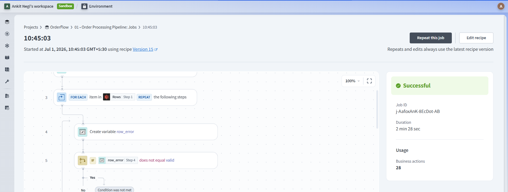
*Workato job history showing successful processing of clean CSV file*

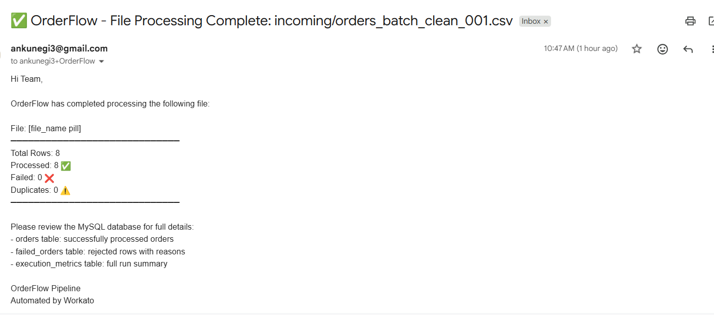
*Gmail processing summary showing all rows processed successfully*

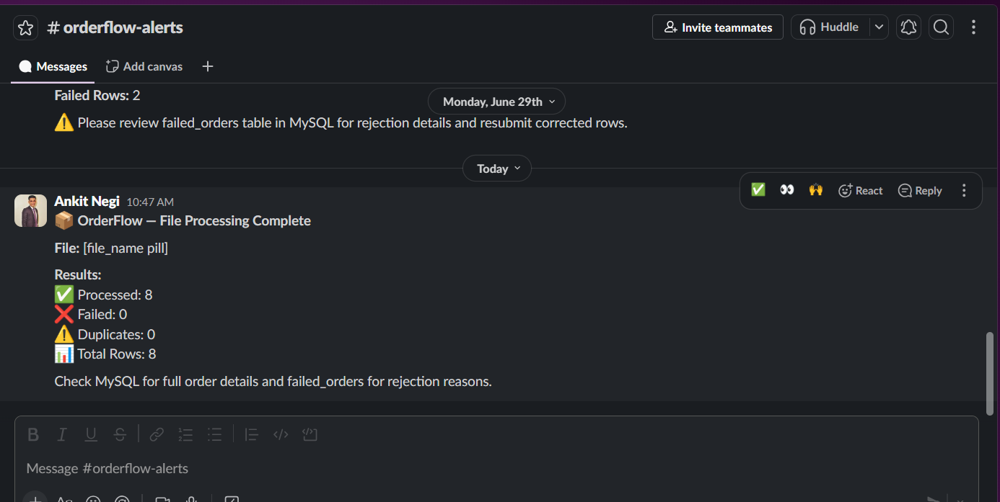
*Slack #orderflow-alerts showing pipeline completion message*

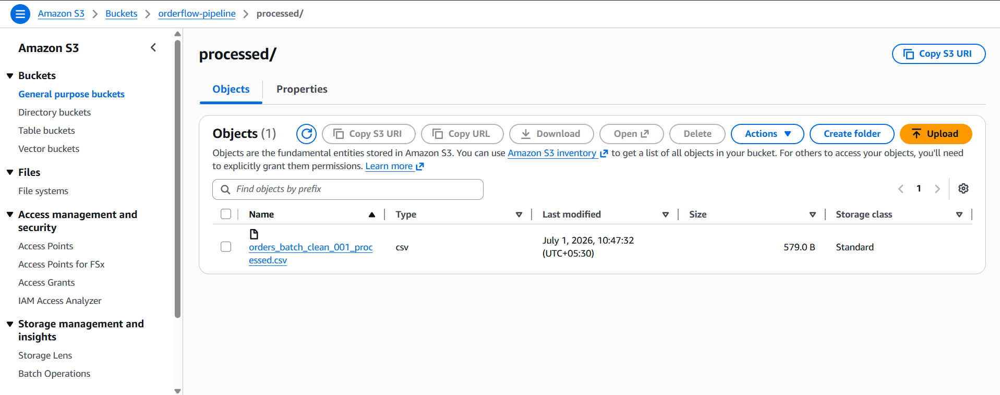
*AWS S3 processed/ folder showing archived file with _processed suffix*

### Partial Failure — File with Validation Errors
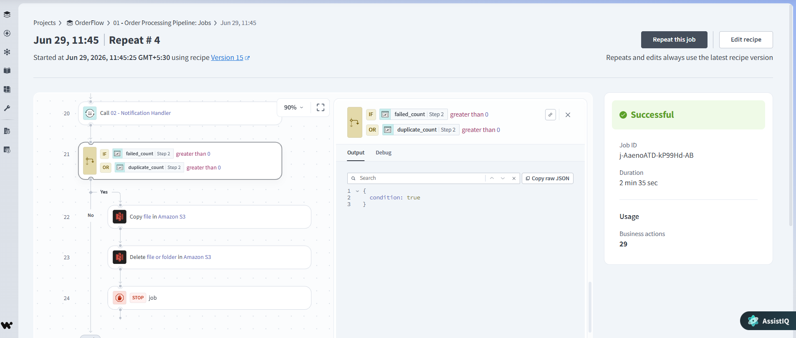
*Workato job showing partial success — valid rows processed, failed rows logged*

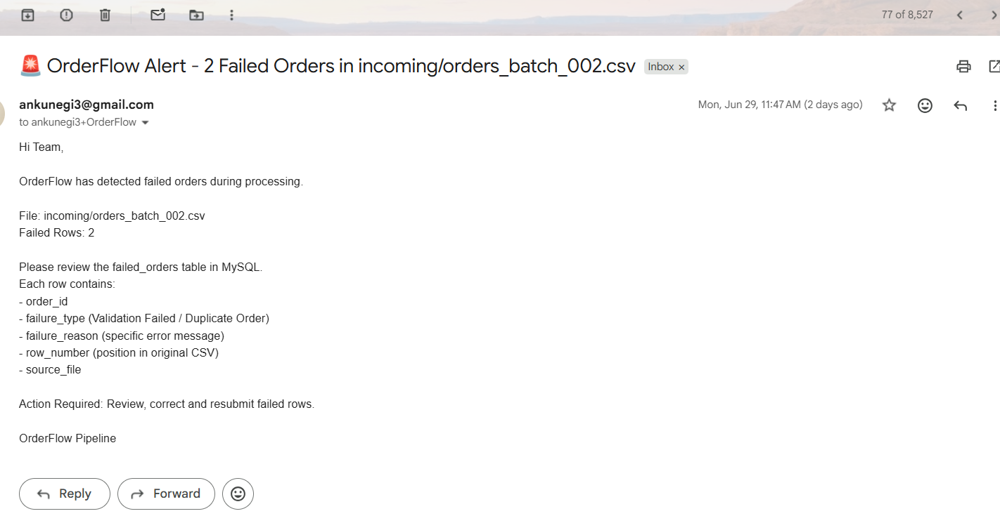
*Gmail failure alert triggered when failed_count > 0*

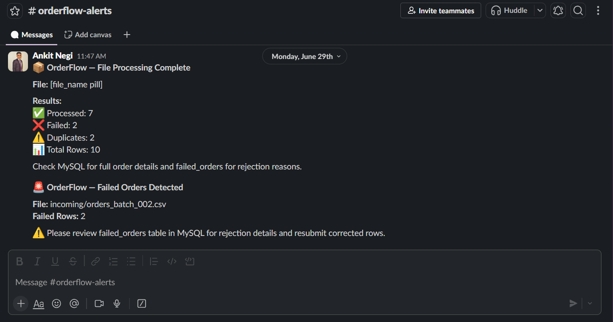
*Slack failure alert in #orderflow-alerts channel*

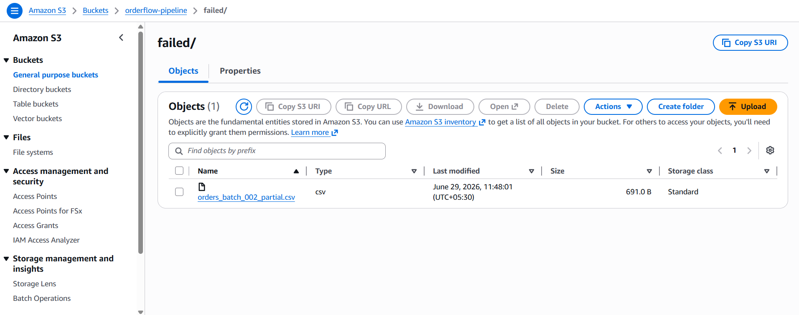
*AWS S3 failed/ folder showing archived file with _partial suffix*

### Database — MySQL Tables
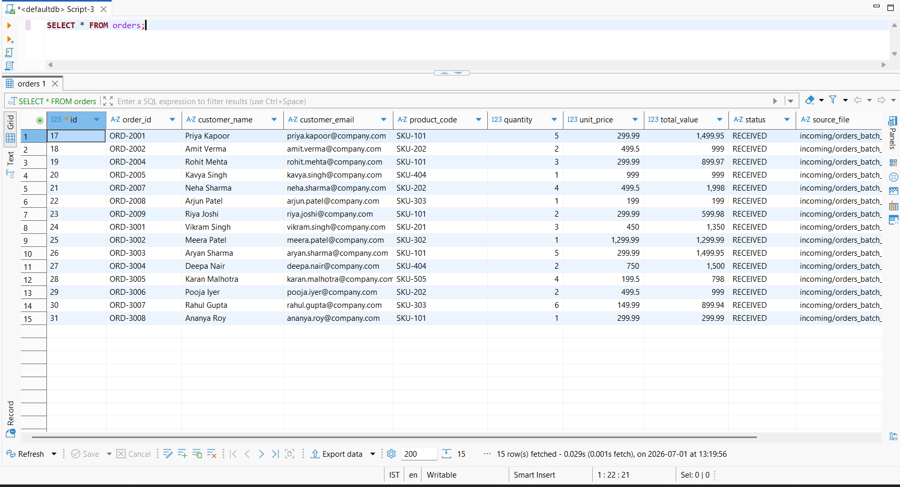
*orders table showing successfully processed orders with computed total_value and RECEIVED status*

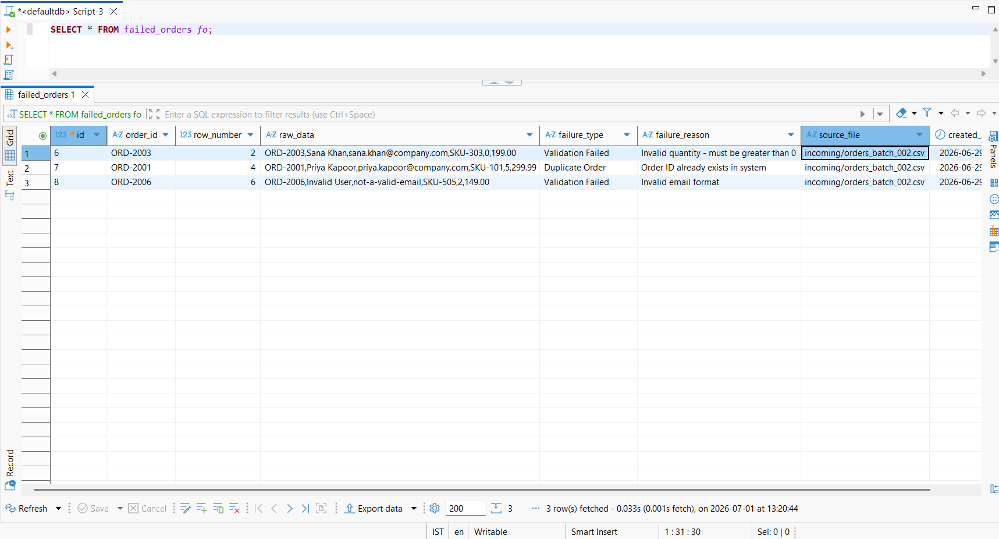
*failed_orders table showing rejected rows with failure_type, failure_reason, and row_number*

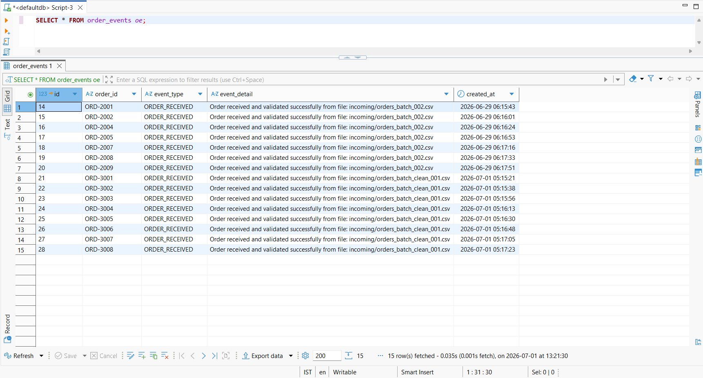
*order_events table showing ORDER_RECEIVED events with source file reference*

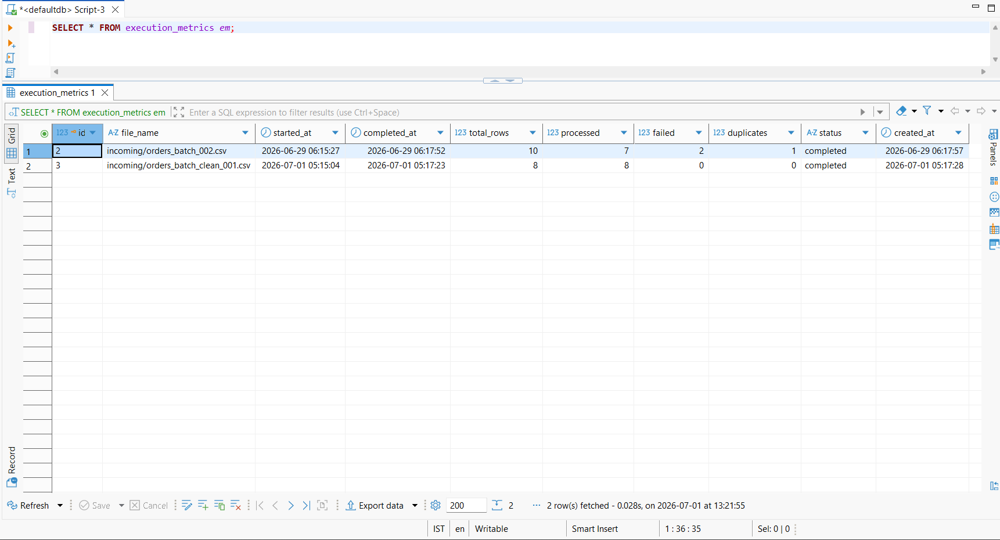
*execution_metrics table showing per-file processing summary with started_at and completed_at*

### Recipe Structure
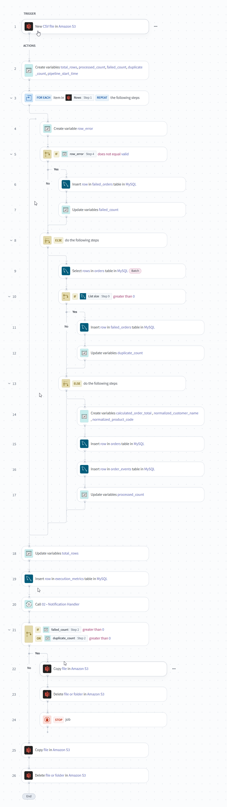
*Recipe 01 — Order Processing Pipeline showing complete orchestration flow*

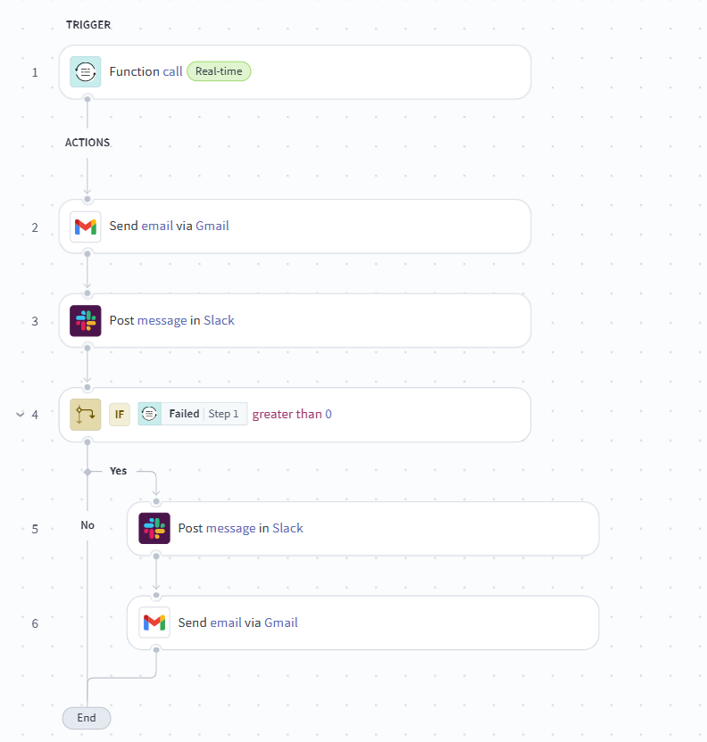
*Recipe 02 — Notification Handler callable recipe*

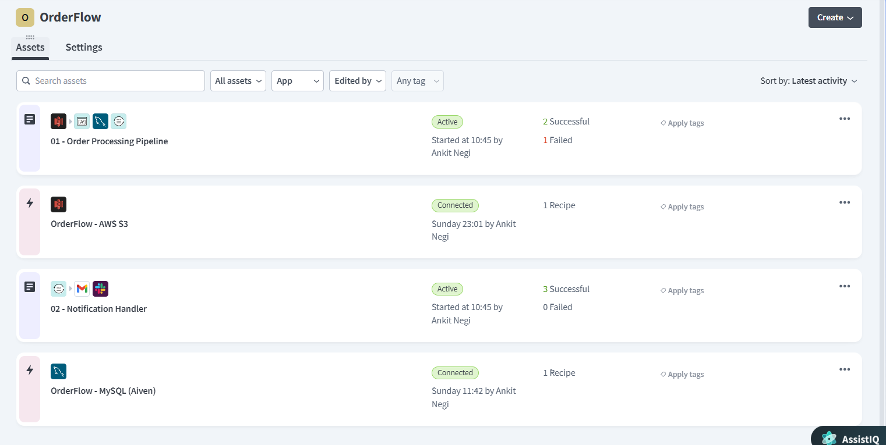
*Both recipes in Running state in OrderFlow project*

### AWS Infrastructure
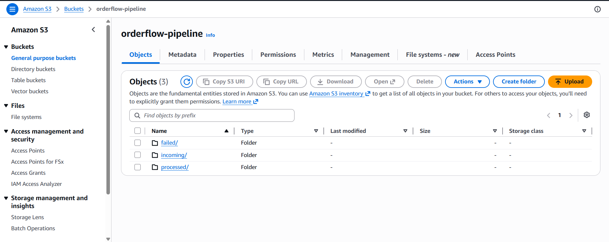
*AWS S3 orderflow-pipeline bucket showing incoming/, processed/, and failed/ folders*

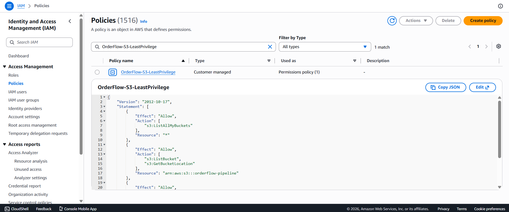
*OrderFlow-S3-LeastPrivilege IAM policy showing minimum required permissions*

## Lessons Learned

### 1. Partial Success Processing Requires Explicit Branch Control
Workato does not have a native "next iteration" action for loops. Implementing partial success required restructuring validation and duplicate checks using nested ELSE blocks — ensuring each row is evaluated independently without stopping the pipeline on individual failures.

### 2. IAM Least Privilege Requires ListAllMyBuckets on *
Scoping S3 permissions to a single bucket is best practice, but Workato's connection verification requires s3:ListAllMyBuckets on * to populate the bucket dropdown. This is a connector-level requirement, not a security gap — documented and accepted as a known platform behaviour.

### 3. S3 Object Name Already Contains Folder Prefix
Workato's S3 trigger returns the full object path including folder prefix (e.g. incoming/filename.csv). Concatenating incoming/ manually caused double-path errors. The fix was to use the Object name pill directly for source operations and strip the prefix only when constructing destination paths.

### 4. Callable Recipes Require Running Status
Recipe 02 (Notification Handler) must be in Running state for Recipe 01 to invoke it successfully — even though it has no independent trigger. This is a Workato platform behaviour worth noting for teams new to callable recipes.

### 5. Storage Decisions Should Match Data Characteristics
Project 1 (AutoProvision) used Google Sheets for audit logging — acceptable for HR workflow automation. Project 2 deliberately chose MySQL to demonstrate that storage technology should be selected based on data characteristics: transactional order data requires ACID compliance and referential integrity, not a spreadsheet.

## Production Considerations

### Error Handling
Current implementation handles business-level errors via dead letter queue. In production:
- Handle errors block around MySQL insert steps for integration-level failures (connection timeouts, deadlocks)
- Retry logic with exponential backoff for transient S3 and MySQL failures
- Complete pipeline failure alerting via PagerDuty or OpsGenie

### Database Constraints
A UNIQUE constraint on `orders.order_id` would be enforced at database level in production to protect against concurrent inserts, complementing the application-level duplicate check already implemented.

### IAM Security
Least-privilege IAM policy (`OrderFlow-S3-LeastPrivilege`) restricts Workato's S3 access to only the `orderflow-pipeline` bucket with minimum required permissions:
- `s3:ListAllMyBuckets` — connection verification (platform requirement)
- `s3:ListBucket` + `s3:GetBucketLocation` — bucket access
- `s3:GetObject` + `s3:PutObject` + `s3:DeleteObject` — file operations

### Idempotent Reprocessing
The pipeline is safe to rerun on previously processed files. Already-inserted orders are caught by the duplicate check and logged to failed_orders — ops teams can resubmit any file without risk of data duplication. This is particularly valuable when a pipeline fails mid-run due to infrastructure issues.

### Scalability
CSV batch size is configurable (default 1000 rows per batch). For high-volume scenarios the pipeline can be extended with parallel processing or chunked file splitting before S3 upload.

### Future Enhancements
- Support for JSON order format in addition to CSV
- Extended order lifecycle events (ORDER_VALIDATED, ORDER_SHIPPED, ORDER_COMPLETED)
- Failed/ folder reprocessing workflow — ops team moves corrected files back to incoming/ for automatic reprocessing
- Multi-supplier routing based on filename prefix or folder path

## SQL Schema
See [sql/schema.sql](sql/schema.sql) for complete database schema with all four tables.

## Sample Files
See [sample-files/](sample-files/) folder for test CSV files used during development and testing.
