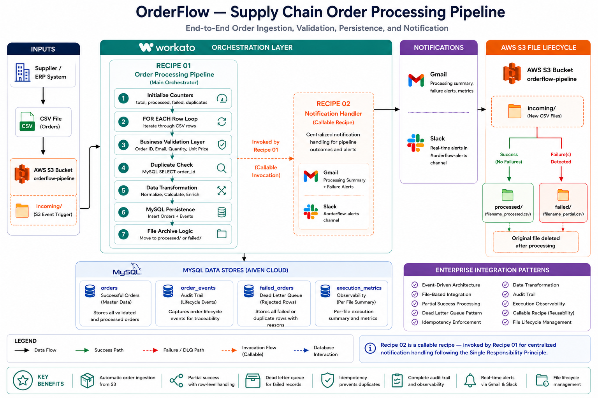

# OrderFlow — Supply Chain Order Processing Pipeline

## Overview
OrderFlow is an enterprise-grade supply chain order processing pipeline built on Workato. 
It automates the complete order ingestion lifecycle — from CSV file detection in AWS S3 
to validation, duplicate detection, data transformation, MySQL persistence, notifications, 
and file archival — with partial success processing, dead letter queue logging, and 
execution observability.

## Live Demo
| File | Description |
|---|---|
| [orders_batch_001.csv](sample-files/orders_batch_001.csv) | Sample file with intentional errors (validation failures + duplicate) |
| [orders_batch_clean_001.csv](sample-files/orders_batch_clean_001.csv) | Clean file with all valid orders |

## Business Problem
Supplier orders commonly arrive as CSV files via file transfer systems (S3, SFTP, FTP). 
Manual processing causes:
- Delayed order entry and fulfillment
- Duplicate orders creating inventory conflicts
- Inconsistent data formats across suppliers
- No visibility into processing failures
- No audit trail for compliance

OrderFlow automates the complete order ingestion pipeline — validating, transforming, 
persisting, and notifying in seconds rather than hours.

## Architecture

## Workflow

### Onboarding Flow
1. Supplier drops CSV file into AWS S3 `incoming/` folder
2. Workato detects new file via event-driven S3 trigger
3. Pipeline initializes execution counters (total, processed, failed, duplicates)
4. For each row in CSV:
   - **Validation** — checks Order ID format, email format, quantity > 0, unit price > 0
   - If validation fails → row logged to `failed_orders` table (Dead Letter Queue)
   - If validation passes → **Duplicate check** via MySQL SELECT on order_id
   - If duplicate found → row logged to `failed_orders` table
   - If new order → **Data transformation** (normalize name, uppercase product code, calculate total)
   - Insert to `orders` table
   - Insert to `order_events` table (ORDER_RECEIVED event)
   - Increment processed counter
5. Update total_rows counter
6. Insert execution summary to `execution_metrics` table
7. Call Recipe 02 — Notification Handler (Gmail + Slack)
8. Archive file:
   - Failures detected → move to `failed/filename_partial.csv`
   - No failures → move to `processed/filename_processed.csv`
9. Delete original file from `incoming/` folder

## Recipes
| Recipe | Description |
|---|---|
| 01 - Order Processing Pipeline | Main orchestration — S3 trigger, row-level processing, MySQL persistence, file archival |
| 02 - Notification Handler | Centralized callable recipe for Gmail and Slack notifications |

## Tech Stack
| Tool | Purpose |
|---|---|
| Workato | iPaaS orchestration platform |
| AWS S3 | Event-driven file trigger + file lifecycle management |
| MySQL (Aiven) | Order persistence, audit trail, dead letter queue, execution metrics |
| Gmail | Processing summary + failure alerts |
| Slack | Real-time pipeline alerts to #orderflow-alerts |
| Postman | API testing |
| DBeaver | MySQL database management |

## AWS S3 Structure

| Folder | Purpose |
|---|---|
| `incoming/` | Workato monitors this folder — new CSV files trigger the pipeline automatically |
| `processed/` | Successfully processed files archived here with `_processed` suffix |
| `failed/` | Partially failed files archived here with `_partial` suffix |

**Bucket name:** `orderflow-pipeline`  
**Region:** ap-southeast-2 (Sydney)  
**IAM Policy:** `OrderFlow-S3-LeastPrivilege` — least privilege access for Workato

## Database Schema
### orders
Stores all successfully validated and processed orders.
| Column | Type | Description |
|---|---|---|
| id | INT (PK, AI) | Auto-increment primary key |
| order_id | VARCHAR(50) UNIQUE | Business key (ORD-XXXX format) |
| customer_name | VARCHAR(100) | Normalized — trimmed and capitalized |
| customer_email | VARCHAR(100) | Validated via regex |
| product_code | VARCHAR(50) | Uppercased during transformation |
| quantity | INT | Validated > 0 |
| unit_price | DECIMAL(10,2) | Validated > 0 |
| total_value | DECIMAL(10,2) | Computed: quantity × unit_price |
| status | VARCHAR(20) | RECEIVED / PROCESSING / COMPLETED |
| source_file | VARCHAR(200) | Source CSV filename |
| created_at | TIMESTAMP | Auto-set on insert |

### order_events
Order lifecycle audit trail — one row per event per order.
| Column | Type | Description |
|---|---|---|
| id | INT (PK, AI) | Auto-increment primary key |
| order_id | VARCHAR(50) | References orders.order_id |
| event_type | VARCHAR(50) | ORDER_RECEIVED, ORDER_VALIDATED etc. |
| event_detail | TEXT | Full event description with source file |
| created_at | TIMESTAMP | Auto-set on insert |

### failed_orders
Dead letter queue — all rejected rows with specific failure reasons.
| Column | Type | Description |
|---|---|---|
| id | INT (PK, AI) | Auto-increment primary key |
| order_id | VARCHAR(50) | Order ID from CSV row |
| row_number | INT | Row position in source CSV |
| raw_data | TEXT | Full raw row for reprocessing |
| failure_type | VARCHAR(50) | Validation Failed / Duplicate Order |
| failure_reason | TEXT | Specific error message |
| source_file | VARCHAR(200) | Source CSV filename |
| created_at | TIMESTAMP | Auto-set on insert |

### execution_metrics
Per-file processing summary for operational observability.
| Column | Type | Description |
|---|---|---|
| id | INT (PK, AI) | Auto-increment primary key |
| file_name | VARCHAR(200) | Processed CSV filename |
| total_rows | INT | Total rows in file |
| processed | INT | Successfully inserted orders |
| failed | INT | Validation + business failures |
| duplicates | INT | Duplicate order IDs skipped |
| started_at | TIMESTAMP | Pipeline start time |
| completed_at | TIMESTAMP | Pipeline completion time |
| status | VARCHAR(20) | completed / partial / failed |
| created_at | TIMESTAMP | Auto-set on insert |

## Key Features
- ✅ Event-driven S3 trigger — pipeline fires automatically on new CSV upload
- ✅ Row-level validation (Order ID format, email regex, quantity, unit price)
- ✅ Partial success processing — valid rows processed even when others fail
- ✅ Dead letter queue pattern — all rejected rows logged with specific failure reasons
- ✅ Idempotency — duplicate order_id detection prevents double processing
- ✅ Data transformation — normalization and computed fields before persistence
- ✅ Order events audit trail — lifecycle events logged per order
- ✅ Execution metrics — per-file processing summary for observability
- ✅ File lifecycle management — files archived to processed/ or failed/ folders
- ✅ Centralized notification handler via callable recipe pattern
- ✅ Least-privilege IAM policy for AWS S3 access

## Why This Architecture

### Why AWS S3 as trigger?
File-based integration is the dominant pattern in supply chain. Suppliers commonly 
deliver order files via S3, SFTP, or FTP. Using S3 as the event source mirrors 
real enterprise supply chain integration architecture.

### Why Workato as orchestration?
Workato provides native connectors for S3, MySQL, Gmail, and Slack with built-in 
error handling, retry logic, and job monitoring — allowing focus on integration 
logic rather than infrastructure.

### Why MySQL over Google Sheets?
MySQL provides ACID compliance, referential integrity, UNIQUE constraints, and 
scalable querying — essential for order data that drives business decisions. 
Google Sheets is not suitable for transactional data at scale.

### Why separate order_events table?
Separating events from orders follows the Event Sourcing pattern — enabling 
complete lifecycle visibility per order without polluting the orders table. 
Future events (ORDER_VALIDATED, ORDER_SHIPPED, ORDER_COMPLETED) can be added 
without schema changes.

### Why execution_metrics table?
Per-file metrics enable operational observability — ops teams can query processing 
history, identify patterns in failures, and monitor pipeline performance over time 
without digging through Workato job logs.

### Why failed_orders as dead letter queue?
Failed rows are preserved with their raw data and specific failure reason — enabling 
ops teams to correct and resubmit individual rows without reprocessing the entire file.

### Why file archival to processed/ and failed/ folders?
File lifecycle management provides visual operational status at a glance. Ops teams 
can identify files needing attention by checking the failed/ folder without querying 
the database.

### Why callable recipe for notifications?
Following Single Responsibility Principle — Recipe 01 handles orchestration, 
Recipe 02 handles notifications. Changes to notification format or channels require 
updating only one recipe.

## Enterprise Integration Patterns Demonstrated
- **Event-driven integration** — S3 file drop triggers automated pipeline
- **File-based integration** — CSV parsing with row-level processing
- **Partial success processing** — pipeline continues on individual row failures
- **Dead Letter Queue** — rejected rows preserved for investigation and resubmission
- **Idempotency** — duplicate detection prevents double processing on resubmission
- **Data transformation** — normalization and computed fields before persistence
- **Audit trail** — order_events table tracks complete lifecycle per order
- **Observability** — execution_metrics table provides per-file processing summary
- **File lifecycle management** — incoming → processed/failed archival pattern
- **Callable Recipe Pattern** — reusable notification handler across pipeline

## Production Considerations

### Error Handling
Current implementation handles business-level errors via dead letter queue. 
In production:
- Handle errors block around MySQL insert steps for integration-level failures
- Retry logic with exponential backoff for transient S3 and MySQL failures
- Complete pipeline failure alerting via PagerDuty or OpsGenie

### Database Constraints
A UNIQUE constraint on `orders.order_id` would be enforced at database level 
in production to protect against concurrent inserts, complementing the 
application-level duplicate check already implemented.

### IAM Security
Least-privilege IAM policy (`OrderFlow-S3-LeastPrivilege`) restricts Workato's 
S3 access to only the `orderflow-pipeline` bucket with minimum required permissions:
- `s3:ListAllMyBuckets` — connection verification
- `s3:ListBucket` + `s3:GetBucketLocation` — bucket access
- `s3:GetObject` + `s3:PutObject` + `s3:DeleteObject` — file operations

### File Reprocessing
Pipeline is idempotent by design — resubmitting a previously processed file skips 
already-inserted orders (logged as duplicates) and processes only new or 
previously failed rows.

### Scalability
CSV batch size is configurable (default 1000 rows per batch). For high-volume 
scenarios the pipeline can be extended with parallel processing or chunked file 
splitting before S3 upload.

## Sample Files
See [sample-files/](sample-files/) folder for test CSV files.

## SQL Schema
See [sql/schema.sql](sql/schema.sql) for complete database schema.

## Resume Description
Built **OrderFlow**, an enterprise supply chain order processing pipeline on Workato, 
implementing event-driven CSV ingestion from AWS S3 with row-level validation, 
partial success processing, dead letter queue pattern, data transformation, MySQL 
persistence across 4 normalized tables, file lifecycle management, and operational 
observability via execution metrics — integrating AWS S3, MySQL (Aiven), Gmail, 
and Slack through a modular callable recipe architecture.
